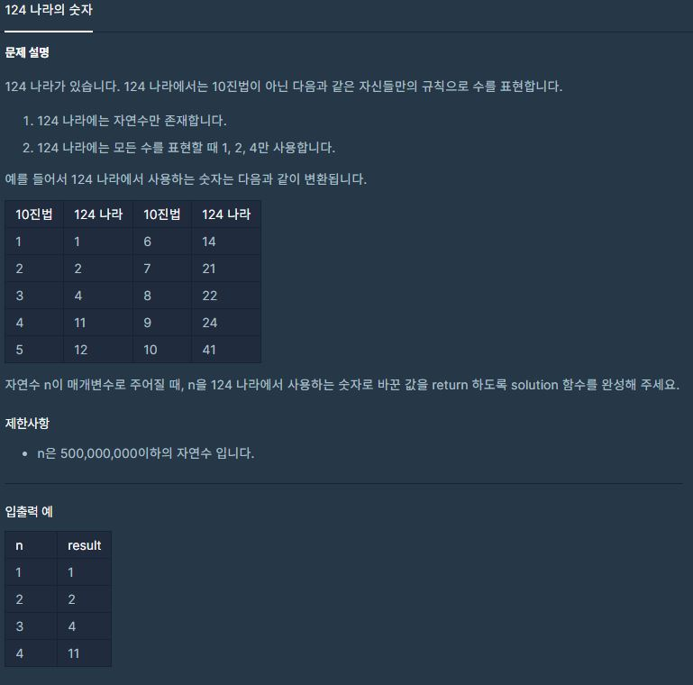

[](https://programmers.co.kr/learn/courses/30/lessons/12899)


## 접근방법
 - 정수 n을 받아서, 2진수를 계산하는 것처럼 나머지 계산으로 접근을 하였다. 정수 n 을 3으로 나눈 `몫` 과 `나머지` 를 이용하려고 애를 썼음.

  1. `n` 을 3 으로 나눈 `나머지`가 `0, 1, 2` 에 따라서 `result` 값의 맨 뒷자리가 `4, 1, 2` 로 갈려진 다는 것을 이용.
  
  2. `n` 을 3 으로 나눈 `몫`이 3보다 크다면, 그 수를 3으로 나눈 몫 과 3 으로 나눈 나머지의 값을 각각 재귀호출하여나온 결과 값을 return 한다.

  3. 이를 재귀적으로 n이 0~3이 될 때 까지 반복해준다.

-----
```py
def solution(n):
    if n == 0 or n == 3:
        return '4'
    if n == 1:
        return '1'
    if n == 2:
        return '2'

    if n > 3:
        # 만약 n이 3으로 나누어 떨어지면, 몫이 그 전 값에 비해 1커지기 때문에, -1 해준다
        # 3으로 나눈 몫이 의미하는 것은, 그 값의 자리수를 의미한다. 
        # (3^자리수-1 ~ 3^자리수) 요 사이 에있으면 해당 자리수 + 1을(나머지가 한자리를 갖고 있기 때문에) 갖는다.
        # 예를들어, 13은 3으로 나누었을 때, 몫은 4고, 나머지는 1이다. (몫은 4이므로, 3^1 ~ 3^2 사이에 있으므로, 총 3 자리를 갖는 값이다.)
        # 이 몫은 3보다 큼으로, 4를 다시 재귀 호출을 하면
        # 몫은 1이고 나머지가 1로 나눠진다.
        # 이를 더해주면, 111 총 3자리가 된다.
        return solution(int((n - 1) / 3)) + solution(n % 3)
```