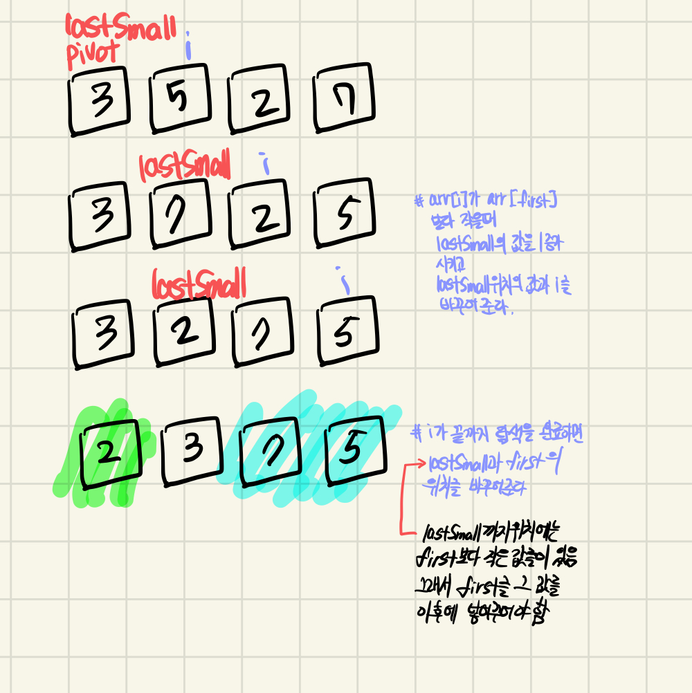

## Quick Sort
 - 분할 정복(재귀 호출)을 통해서 정렬을 하는 방법

- 시간 복잡도가 다른 정렬에비해 빠른 `O(nlogn)` 을 갖는다.

- `Pivot` 을 기준으로 큰 값들은 `Pivot` 의 오른쪽으로, 작은 값은 왼쪽으로 정렬되며 

- 왼쪽, 오른쪽으로 나누어진 각각의 구역(?) Array를 다시 QuickSort를 진행하여 왼쪽, 오른쪽으로 나눈다.

- 이렇게 1개가 남을 때까지 계속해서 나누게 된다면, 정렬이 된다.


### Partiton 함수


 - `Pivot` 값은 맨앞에 위치한 값이다. 그 `Pivot` 값보다 작은 것이 있으면, lastSmall 값을 1 증가시키고, lastSmall에 위치한 값과 작은 값을 서로 바꾸어준다.

 - 0번째까지 탐색을 마치면, lastSmall 값, 즉 `pivot` 보다 작은 값이 마지막까지 있었던 위치와 `Pivot` 과 위치를 바꾸어준다.

 - 현재 pivot의 위치 즉 `lastSmall`을 반환해준다


```cpp
void quickSort(int *arr, const int& first, const int& last) {
    if (first >= last) {
        return;
    }

    int split = partition(arr, first, last);
    quickSort(arr, first, split);
    quickSort(arr, split + 1, last);
}

void swap(int *arr, int& left, int& right) {
    int temp = arr[left];
    arr[left] = arr[right];
    arr[right] = temp;
};

int partition(int *arr, int first, int last) {
    int lastSmall = first;
    for (int i = first + 1; i < last; i++) {
        if (arr[i] >= arr[first]) {
            lastSmall++;
            swap(arr, lastSmall, i);
        }
    }
    swap(arr, first, lastSmall);

    return lastSmall;
}
```