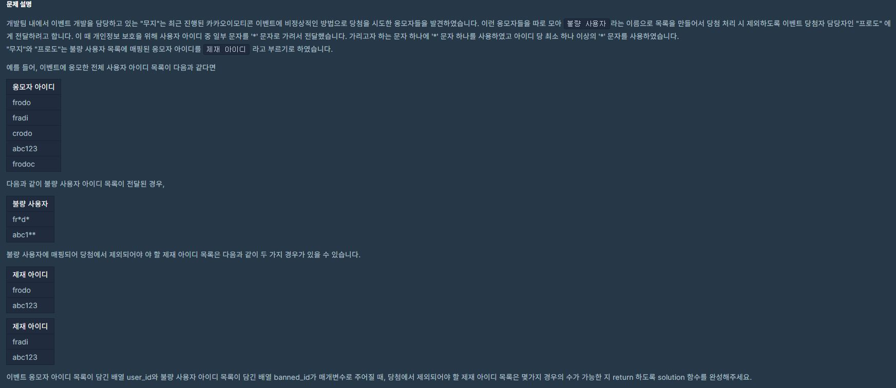

[](https://programmers.co.kr/learn/courses/30/lessons/64064)

## 접근방법
 - `불량사용자` 목록 각각을 조금더 쉽게 이해하기 위해서 `불량 사용자로 뽑을 조건 1,2,3...` 으로 하자
 
 1. `각 불량 사용자로 뽑을 조건` 을 만족하는 모든 `응모자 아이디` 들을 모두 찾는다
    - `각 불량 사용자로 뽑을 조건` 에서 `' * '`를 제외한 알파벳들의 순서가 응모자 아이디의 알파벳 순서와 모두 같을 때 그 응모자의 아이디를 `불량 사용자` 로 간주한다.

 2. `불량 사용자의 조건에 맞는` `응모자 아이디들` 중에서 `각각 1개를 뽑는다`.

 3. 이전에 뽑힌 불량 사용자와 같은 아이디는 뽑지 않는다.
 
 4. 각 조건에 맞는 아이디를 1개씩 뽑았을 때, `서로 다른 불량 사용자 SET` 의 갯수를 반환한다.


---
이렇게 글로 설명하면 이해가 잘 되지 않아서 코드를 보면서 각 줄에 주석을 달아놓기.

```py
def solution(user_ids, banned_ids):
    bad_possible_users = [] # banned_ids와 같은 길이를 갖는다. 각 인덱스에 들어 있는 값들에는, bannded_ids 에 각 인덱스에 있는 `불량 사용자의 조건` 에 맞는 모든 사용자들이 들어있다.

    # `i번의 불량 사용자의 조건` 에 부합하는 응모자의 아이디만 temp 배열에 넣어준다.
    # 이 배열을 bad_possible_users 배열에 넣어준다.
    for banned_id in banned_ids:
        temp = []
        for user_id in user_ids:
            banned_id_length = len(banned_id)
            if banned_id_length == len(user_id):
                flag = True
                for idx in range(banned_id_length):
                    if banned_id[idx] != user_id[idx] and banned_id[idx] != '*':
                        flag = False
                        break

                # 조건에 해당하는 유저만 temp배열에 넣어준다        
                if flag:
                    temp.append(user_id)

        bad_possible_users.append(temp)

    # 각 bad_possible_users에 있는 각 단계의 불량사용자 후보군들을 ans 배열에 넣어준다.
    # 각 단계에서는 1명의 불량 사용자 만 뽑는다.
    # 1명을 뽑고, 그 뽑았을 때를 기준으로 다음 단계 불량 사용자를 뽑고,
    # 그 후 그 1명을 빼고나서 다음 후보자를 뽑는 식으로 불량사용자 set을 만든다. 
    ans = []
    def dfs(answers, level):
        if level == len(banned_ids):
            ans.append(answers)
            return

        for value in bad_possible_users[level]:
            if value not in answers:
                answers.append(value)
                dfs(answers[:], level + 1)
                answers.pop()

    dfs([], 0)

    # ans에는 불량사용자 set을 나타내는 배열이 들어있는데, 중복을 허용하지 않기 위해,
    # 그 값들을 string 값으로 바꾸고 그 길이로 반환을 한다
    ans = set(''.join(sorted(x)) for x in ans)


    return len(ans)
```