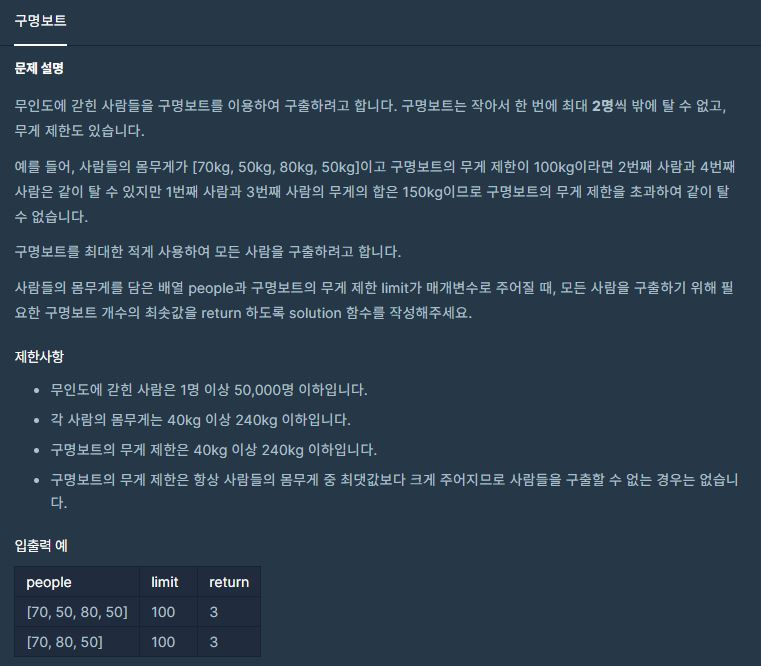

[](https://programmers.co.kr/learn/courses/30/lessons/42885)


## 접근방법
1. `people` 배열을 `정렬` 해준다. `가장 무거운 사람, 가장 가벼운 사람을 사용 하기 위해서`
    - 가장 무거운 사람 + 가장 가벼운 사람 이 배의 무게 제한보다 크다면,
    - 가장 무거운 사람만 빼버린다.

    - 가장 무거운 사람 + 가장 가벼운 사람 이 배의 무게 제한보다 작거나 같다면,
    - 가장 무거운 사람, 가장 가벼운 사람 둘다 뺀다.

2. 시간초과(프로그램)를 막기위해서 배열을 직접 건들지 않고 index pointer를 2개 사용한다.
    - 가장 무거운 사람의 위치 => `big`
        - 가장 무거운 사람이 빠져야 하면 big =- 1 
    - 가장 가벼운 사람의 위치 => `small`
        - 가장 가벼운 사람이 빠져야 하면 smail += 1

3. small 값이 big 값보다 크게 되면 반복문을 중지한다. (모든 사람이 다 빠져나갔음을 의미한다.)

-----
```py
def solution(people: list, limit):
    people.sort()
    small = 0
    big = len(people) - 1
    count = 0

    while small <= big:
        if len(people) > 1 and people[small] + people[big] <= limit:
            small += 1
            big -= 1
        else:
            big -= 1

        count += 1

    return count
```