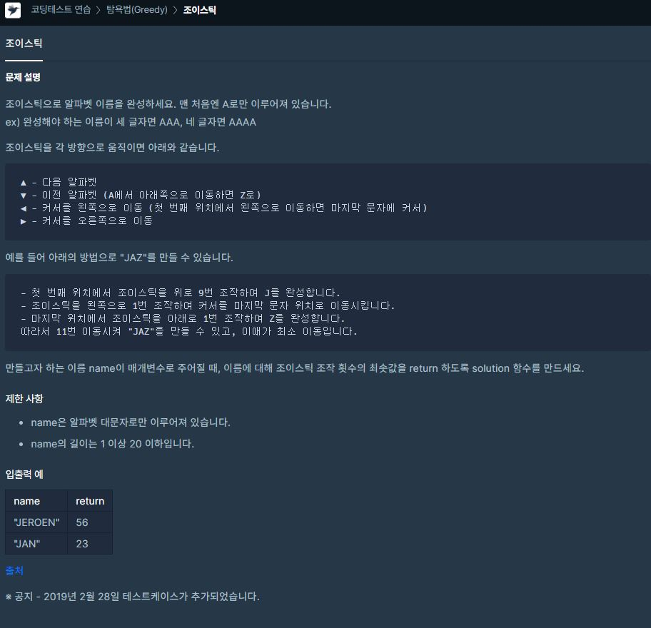

[](https://programmers.co.kr/learn/courses/30/lessons/42860)


## 접근방법

### 위 or 아래 선택
- `타겟 알파벳 의 위치 - 0` 와 `26 - 타겟 알파벳의 위치 + 1` 중 에서 최소 값을 반환 값(total)에 더해준다

### 왼쪽 or 오른쪽 선택 
- **주의! 문제에는 안나와있지만, 왼쪽으로 가는 거리와 오른쪽으로 가는 거리가 같으면 오른쪽으로 가야한다**
- `현재 위치` 에서 `위 or 아래 선택` 을 해서 반환 값에 움직임을 더해준 후에,

- `현재 위치` 에서 `A 가 아닌 알파벳의 위치(이하 다음위치)` 까지 거리를 구한다.

- `다음위치 - 현재위치 의 절대 값` 과 `이름 길이 - (다음 위치 + 1) + 현재 위치 + 1 의 절대 값` 중에서 최소 값을 찾아서 반환 값(total)에 더해준다.

- `다음 위치` 가 정해졌으면, `현재 위치` 를 `다음 위치`로 변경한다.

-----
```py
def find_min_alphabet_movement(target):
    alphabet = {x.upper(): i for i, x in enumerate("abcdefghijklmnopqrstuvwxyz")}

    return min(alphabet[target] - alphabet['A'], alphabet['Z'] - alphabet[target] + 1)

def find_not_A_position(name, completed):
    indexes = []

    # 1. 왼쪽 or 오른쪽 의 최솟 값을 인덱스 값과 함께 배열에 저장한다
    for i in range(len(name)):
        if name[i] != 'A' and i not in completed:
            indexes.append((i, min(abs(i - completed[-1]), abs(len(name) - (i + 1) + completed[-1] + 1))))

    if indexes:
        # 2. 움직임이 저장된 배열 중에서 움직임이 가장 작은 것을 return 
        # 최소 값이 같다면, 오른쪽을 선택 하게 한다
        return min(indexes, key= lambda x: (x[1], (x[0] - completed[-1])))
    else:
        return (completed[-1], 0)

def solution(name):
    if name == 'A' * len(name):
        return 0
        
    completed = []
    total = 0
    now = 0

    while len(completed) < len([x for x in name if x != 'A']):
        if name[0] == 'A' and 0 in completed:
            completed.pop(0)

        up_or_down = find_min_alphabet_movement(name[now])
        total += up_or_down

        completed.append(now)

        idx, left_or_right = find_not_A_position(name, completed)
        now = idx
        total += left_or_right

    return total
```