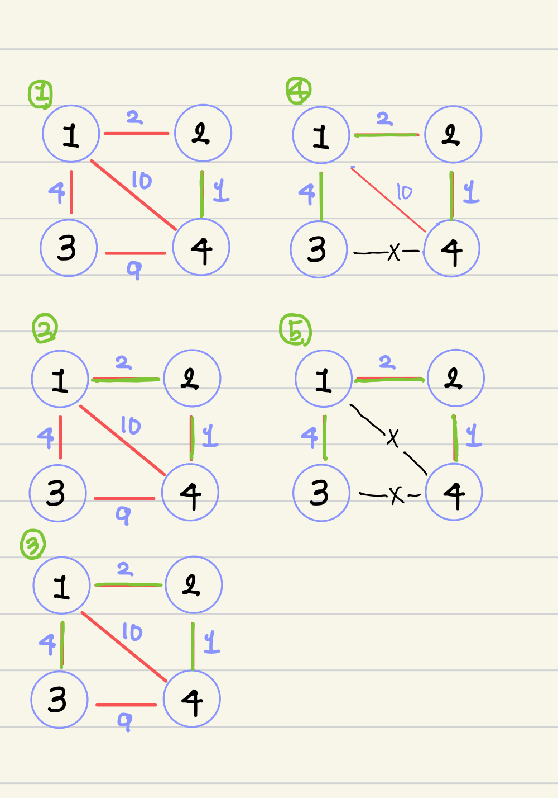

 > - 1-3. 선택되지 않은 간선 중에서 가장 작은 간선 선택
 > -  4-5. 현재 가장 작은 간선이 선택되면 순환구조가 되므로 선택하지 않음

----
## 크루스칼

`크루스칼 알고리즘` 이란, `Greedy` 하게 네트워크의 모든 정점을 최소 비용으로 연결 하는 방법이다. 

최소 신장 트리를 이용하기 떄문에, `Cycle` 이 없이 서로 연결 되어 있다.

  1. 비용을 기준으로 정렬된 순서에 맞게 노드를 그래프에 포함 시킨다.(싸이클이 되는 간선은 포함시키지 않음)
  
  2. 사이클 테이블을 확인하며 그래프를 그린다.(최소비용의 간선들을 선택해서 그래프를 그림)
  
  3. 트리의 간선의 갯수는 `n - 1` 이므로, 간선의 갯수가 `n-1` 개가 될 때까지 최소 비용으로 연결한다.
  

#### `크루스칼 알고리즘`은, 싸이클을 돌지 않도록 하는 것이 중요하다.
그러면, 지금 선택하는 간선이 싸이클을 도는지 않도는지는 어떻게 확인할까?

## 확인법? 서로소 집합

#### Union-Find 알고리즘 사용
- 서로소 집합은, 서로 다른 부분집합을 의미한다. 크루스칼 알고리즘에서 사용할 서로소 집합의 사용법은 다음과 같다.

1. (union)서로 연결 되어 있을 때, 작은 값의 노드가 큰 값의 부모 노드가 된다.

2. (init)부모노드가 없으면 자기자신이 본인 노드가 된다.

3. (find)서로 같은 집합임을 알기 위해선 `2. 부모노드가 없으면 자기자신이 본인 노드가 된다.` 를 이용한다. 

   `N개의 정점 테이블이 있을 때, I번째 칸에 들어 있는 A라는 값이 의미하는 것은, I번의 노드의 부모는 A이다.`

-  즉, 서로 같은 집합임을 알기 위해선 본인위치의 칸이 본인 값을 나타낼 때까지 최상단의 부모노드를 찾을 때, 서로 같은 최상단의 부모노드를 갖고 있으면 같은 집합. 아니면 서로 다른 집합을 의미한다.

- 크루스칼 알고리즘에서 서로 같은 집합(서로 같은 최상단 부모를 갖고 있으면)이면, `cycle`이 있는것으로 간주를 한다

### 크루스칼 알고리즘 사용
 > `Graph = [p, q, weights]`
1. Graph를 간선의 비용이 가장 작게 `정렬`한다

2. Graph를 간선의 비용을 가장 작은 것을 뽑아서 `p` 의 최상단 부모, `q`의 최상단 부모를 찾는다.

3. 서로 같은 집합이 아니면, `p` 와 `q` 를 합친다. `즉, p가 q보다 작다면 p가 q의 부모가 되도록 한다.`

4. 서로 같은 집합이 아닌 간선만 따로 뽑아서, 실제 사용될 최소비용 간선 배열`(edges)`에 추가해준다.

5. 최소비용 트리 배열의 edges의 길이가 `n-1`개 가 될 때까지, 반복한다