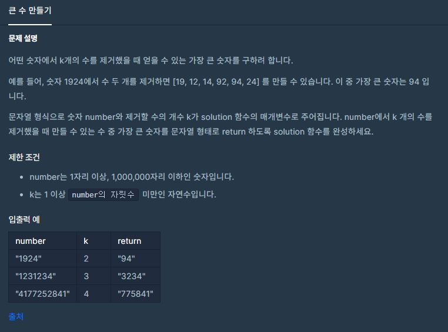

[](https://programmers.co.kr/learn/courses/30/lessons/42883)


## 접근방법
### 그리디 문제 임을 이용
1. 그리디 문제임으로, 하나 하나 선택할 때, 근거 있는 수를 선택해야 한다.
    - 가장 큰 수를 만드는 것임으로, 선택 할 수 있는 수의 범위 중에서 가장 큰 수를 고른다.
    
    - 선택 할 수 있는 범위는 `이전에 선택된 위치의 다음위치 ~ 이전에 선택된 위치의 다음위치 + 빠져야하는 개수` 이다.
        
        - 이 범위는 다음과 같이 도출 되었다.
            1. `1231234` 에서 `3개` 를 뺀 수의 경우의 수중 마지막 수는 `1234` 이다.
            
            2. 이는 인덱스 `3`의 위치한 수를 맨 처음 선택했을 때 나온다.
            
            3. `이전에 뽑은 위치의 다음 위치 + 빠져야하는 개수` 에 해당하는 인덱스 값 이후의 위치가 선택 되면 원하는 숫자의 길이 `number 의 길이 - k`를 만들 수 없기 때문에, `이전에 선택된 위치의 다음위치 ~ 이전에 선택한 위치의 다음 위치 + 빠져야하는 개수` 까지 선택 해야한다.

2. 빠져야하는 갯수는, 한번에 2개 3개씩 빠질 수 있기 때문에, `현재 시점에서 빠져야하는 갯수 - (현재 선택된 위치 - 이전에 선택된 위치)` 의 수식을 통해서 빠져야하는 갯수를 갱신 시켜준다.

3. 총 선택된 숫자의 길이가 `number 의 길이 - k` 가 되면 `return` 해준다.

## 아쉬운 점,
 - 처음에는 재귀 함수로 풀이했다가 while 문으로 바꿔서 풀었는데
 - 왜 처음부터 반복문으로 안풀었엇던 것에 대해서 아쉬웠다. (반복문이 조금더 빠른 실행 속도를 갖는듯 함)
 - 웬만하면 재구함수로 구현하는 것은 지양 해야겠다.(코테하면서)

-----
```py
def solution(number, k):
    start = 0
    last = k
    result = ''

    while len(result) < len(number) - k:
        if last > 0:
            max_number = number[start]
            max_index = start

            for i in range(start, start + last + 1):
                if max_number == '9':
                    break
                if max_number < number[i]:
                    max_number = number[i]
                    max_index = i

            last = last - (max_index - start)
            start = max_index + 1
            result += max_number

        else:
            result += number[start:]

    return result
```