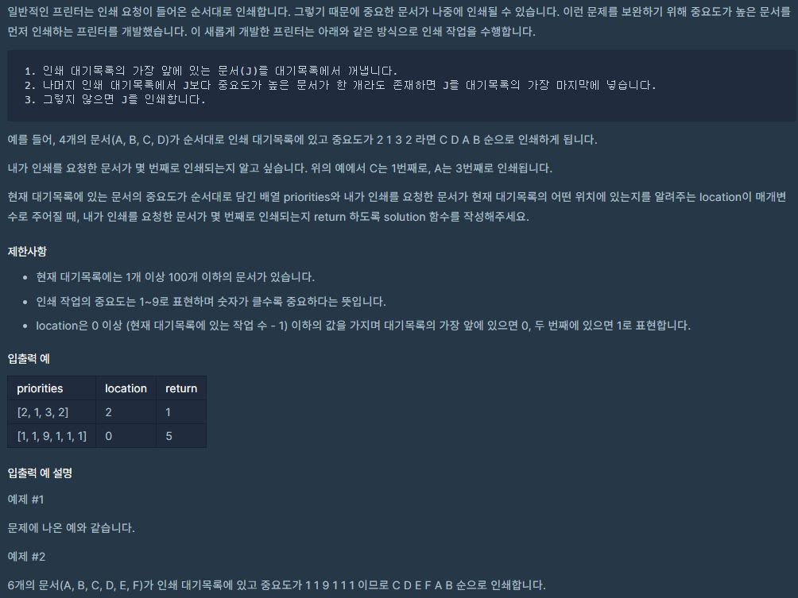

[](https://programmers.co.kr/learn/courses/30/lessons/42587)


## 접근방법
 - 문제 설명대로 하면 된다.
1. `Queue` 자료구조를 사용한다. 
    - 종료 조건: 값이 빠져나갈때, 초기 위치의 값과 `location` 값이 같은지를 확인해줘야한다.
    - 따라서, `Queue`을 초기화 할 때, `priority 값과 위치 값을 한번에 넣어준다`
2. `Queue` 에서 제일 왼쪽 값을 빼고 난 후, 그 값보다 큰 값이 `Queue`에 있는지 확인한다
    - 뺀 값 보다 큰 값이 있다면, 그 뺀 값을 `Queue`에 다시 넣어준다. (맨 오른쪽으로 들어감)
    - 뺀 값 보다 큰 값이 없다면, `count`를 1증가 시켜준다.
3. 뺐을 때, 뺀 값의 위치가 `location` 과 동일하면 `count` 값을 `return` 한다.
-----
```py
def solution(priorities, location):
    import collections
    # `Queue`을 초기화 할 때, `priority 값과 위치 값을 한번에 넣어준다`
    queue = collections.deque([[i, x] for i, x in enumerate(priorities)])
    count = 0
    # 2. `Queue` 에서 제일 왼쪽 값을 빼고 난 후, 그 값보다 큰 값이 `Queue`에 있는지 확인한다
    # - 뺀 값 보다 큰 값이 있다면, 그 뺀 값을 `Queue`에 다시 넣어준다. (맨 오른쪽으로 들어감)
    # - 뺀 값 보다 큰 값이 없다면, `count`를 1증가 시켜준다.
    while queue:
        i, v = queue.popleft()
        if (any(x > v for j, x in queue)):
            queue.append((i, v))
        else:
            count += 1
            # 3. 뺐을 때, 뺀 값의 위치가 `location` 과 동일하면 `count` 값을 `return` 한다.
            if i == location:
                return count


    return count
```