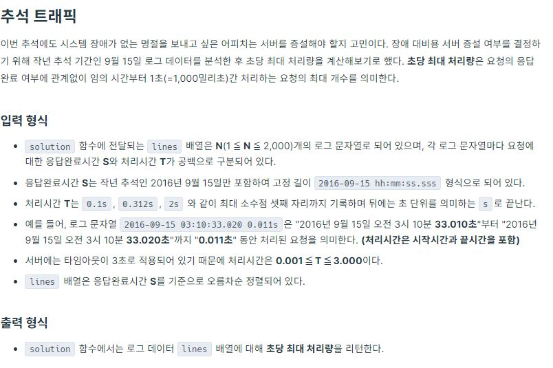

[](https://programmers.co.kr/learn/courses/30/lessons/17676)

## 접근방법
1. 가장 많은 경우의 수는 각 로그가 끝날 때를 기준으로, 1초간 검사를 할 떄, 가장 많은 경우의 수를 구할 수 있다.

2. 함수의 원소로 들어오는 것은 `2016-09-15 03:10:33.020 0.011s` 으로 들어 오는데, 1초 (1000ms)간 들어오는 것을 확인하려면 시, 분, 초를 모두 `1ms` 를 기준으로 만들어줘야 한다. (날짜는 어차피 고정이기 때문에 뺀다)

3. [응답요청시간, 응답완료시간]을 갖는 배열을 만든다
    - 각 로그의 응답완료시간을 기준으로 `+ 1000ms` 한 값을 사용.
   
    - 다른 로그들이 그 시간 사이`(응답완료시간, 응답완료시간 + 1000)`에 속하게 되면 `count += 1` 해준다.
        - 1. 다른 로그가, 해당 `타임라인의 앞부분` 보다 빨리 요청이 되고, 해당 `타임라인의 뒷부분`보다 늦게 완료가 되었을 때.
        
        - 2. 다른 로그가, 해당 `타임라인의 앞부분` 보다 늦게 요청이 되었지만, 그 요청이 `타임라인의 뒷부분` 보다 빨리 요청 되었을 때.

        - 3. 다른 로그가, 해당 `타임라인의 앞부분` 보다 빨리 완료가 되었지만, 그게 `타임라인의 뒷부분` 보다 늦게 요청 되었을 때.


4. 처리시간은 시작시간과 끝 시간을 포함하기 때문에, `S(응답완료시간) - T(처리시간) + 1ms` 를 한 것이 `응답요청시간`을 의미한다.

-----

```py
def solution(lines: list):
    new_lines = []

    for i in range(len(lines)):
        arr = lines[i].split(' ')
        
        h, m, s = list(map(float, arr[1].split(':'))) 
        t = float(arr[2][:-1]) * 1000 # 응답 처리 시간
        sum_of_s = (h * 3600 + m * 60 + s) * 1000 # 응답 완료 시간

        new_lines.append((sum_of_s - t + 1, sum_of_s)) # [응답 요청 시간, 응답 완료 시간]

    count = 0
    for j in range(len(new_lines)):
        temp_end = set()
        s = new_lines[j]

        for i in range(len(new_lines)):
            if (new_lines[i][0] <= s[1] and (new_lines[i][1] > s[1] + 1000)): # 1. 다른 로그가, 해당 `타임라인의 앞부분` 보다 빨리 요청이 되고, 해당 `타임라인의 뒷부분`보다 늦게 완료가 되었을 때.
                temp_end.add(i)
            elif (s[1] <= new_lines[i][0] < s[1] + 1000): # 2. 다른 로그가, 해당 `타임라인의 앞부분` 보다 늦게 요청이 되었지만, 그 요청이 `타임라인의 뒷부분` 보다 빨리 요청 되었을 때.
                temp_end.add(i)
            elif (s[1] <= new_lines[i][1] < s[1] + 1000): # 3. 3. 다른 로그가, 해당 `타임라인의 앞부분` 보다 빨리 완료가 되었지만, 그게 `타임라인의 뒷부분` 보다 늦게 요청 되었을 때.
                temp_end.add(i)

        count = max(count, len(temp_end))

    return count
```