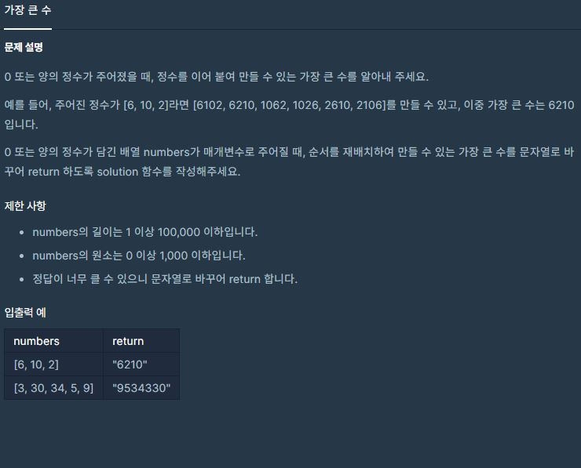

[](https://programmers.co.kr/learn/courses/30/lessons/42746)


## 접근방법
1. 정렬문제 어떻게 정렬할 것인가? 
    - 앞자리수 가 가장 큰 수가 앞으로 가도록 정렬한다. 
    - 이 수들을 문자열로 합치고 return 한다
    
2. 문제:  `300, 34, 3420` 과 같이 앞자리들이 같은경우 -> 비교하기 힘들다
    - 배열을 쉽게 하기 위해 숫자의 자리수를 같게 만들어준다.
        - 300은 34보다 작다. 또한 34는 342보다 앞서 있어야한다.
        - `3420 뒤에 34` 가 있으면 `342034` 가 되는데,
        - '34 뒤에 3420' 가 있으면 `343420` 가 된다.
        - 즉, 최대 길이만큼 자신을 반복하여 수를 붙여서 만들어 줘서 비교하도록 한다.
        - 예) `213 는 213212 보다 앞에 있어야하며, 2132보다 뒤에 있어야한다`
 

-----
```py
def solution(numbers):
    numbers = [str(x) for x in numbers]
    max_length = len(max(numbers, key=lambda x:len(x)))
    positioned_numbers = []

    # 정렬을 쉽게 하기 위해서 숫자의 자리수를 같게 만들어주는 과정
    for i in range(len(numbers)):
        number = numbers[i]
        length = len(number)

        # 숫자를 반복할 최소의 곱을 해주고, 최대길이 만큼 짤라준다.
        if length < max_length:
            number *= int(max_length / length) + 1
            number = number[:max_length]

        # 최대길이만큼 만들어준 숫자들을 인덱스 값과 함께 배열에 넣어준다
        positioned_numbers.append((number, i))

    # 큰 순서대로 정렬을해준다.
    positioned_numbers.sort(key= lambda x: x[0], reverse=True)

    # 큰 순서대로 정렬된 배열을 기준으로 반환해줄 배열을 정렬시켜준다
    numbers = [numbers[i] for _, i in positioned_numbers]

    ## 0000 과 같은 값이 나올 수 있기 때문에 int로 한번 변환후 str로 변환 한다
    return str(int(''.join([x for x in numbers])))
```