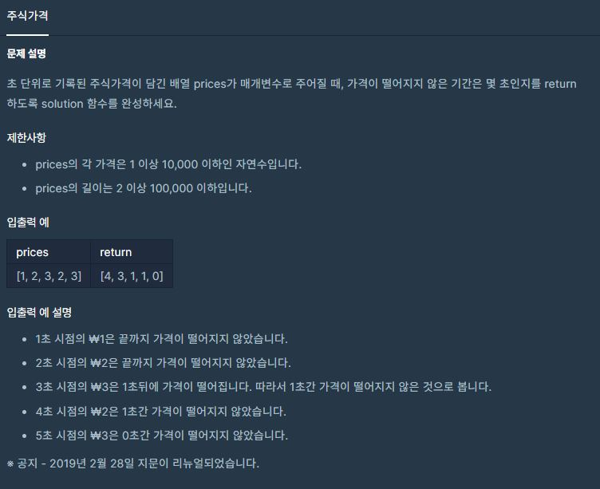

[](https://programmers.co.kr/learn/courses/30/lessons/42584)


## 접근방법
1. `Queue` 자료구조를 사용하는 문제이다. (배열 맨 앞에 있는 값을 그 뒤에 있는 값을 비교하는 것으로 판단)
    - `큐` 자료구조를 사용하지 않고 `index pointer (이하 idx)` 를 사용해서 문제를 풀이 하였다.
    - `idx` 를 `0(맨 앞)`부터 `prices` 의 길이까지 `1씩 증가` 시킨다.

2. `idx` 위치에 있는 값을 `idx + 1 이후` 위치에 있는 값 들과 비교 한다.
    - 이 때, 반복문을 돌며 값 들을 비교하는데, 다음 값을 비교할 때마다 초를 기록 하는 `sec`를 1씩 증가 시킨다.
    
        - `idx` 위치에 있는 값 보다 큰 것이 있으면 break 한다.

3. 비교가 끝나면 초들을 저장하는 `seconds` 배열에 `sec` 를 추가해준다.

4. 이를 `idx` 값이 `prices`의 값보다 커질 때 까지 반복한다.

  #### *+ 사실 queue 자료구조를 사용해서 문제를 풀어도 될 것 같았지만, 자료구조를 사용하지 않는 방법(?)을 고안하려다 이렇게 되돌아가는(?) 방법을 사용하였다.*

-----
```py
def solution(prices):
    seconds = []
    idx = 0

    while len(prices) > idx:
        price = prices[idx]
        sec = 0

        for next_idx in range(idx + 1, len(prices)):
            sec += 1
            if(prices[next_idx] < price):
                break

        seconds.append(sec)
        idx += 1


    return seconds
```