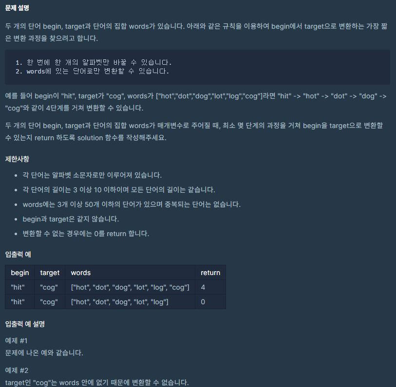

[](https://programmers.co.kr/learn/courses/30/lessons/43163)

## 접근방법
 1. 서로 다른 알파벳의 갯수가 1개일 때, 현재 탐색하는 단어를 그 단어로 바꾸고, 다음 단어를 확인한다. `(재귀 함수 사용)`
 
 2. 현재 탐색해야하는 단어가 찾아야하는 타겟 단어랑 같다면 현재 `level` 과 
    탐색 해왔던 `level` 값중 최솟 값을 저장

 3. 만약 아무 `level` 도 저장이 되어 있지 않으면, 0을 return

```py
# 틀린 알파벳의 갯수를 체크해서
# 틀린 알파벳의 갯수가 1보다 크면 False
# 틀린 알파벳의 갯수가 1이면 True를 Return 한다.
def check_word(next_word, now_word):
    wrong_count = 0
    for i in range(len(next_word)):        
        if next_word[i] != now_word[i]:
            wrong_count += 1
            
        if wrong_count > 1:
            return False
    
    return True

# `results` 에 최종 레벨(target 단어로의 변환의 완료) 됐을 때, 모든 경우의 단계 값을 넣어줍니다.

# level의 최솟값을 return 합니다
def solution(begin, target, words):
    results = []
    
    def dfs(now_word, level, rest_words):
        if rest_words:
            if now_word == target:
                if len(results) == 0:
                    return results.append(level)
                elif level < results[-1]: # 최솟값으로 갱신하기
                    results[-1] = level
                    return

            for i in range(len(rest_words)):
                if check_word(rest_words[i], now_word): # 알파벳이 서로 1개만 다를 경우, 재귀함수를 호출한다. (level을 1을 올려주고, 현재 단어를 제외한 words 배열을 넣어준다)
                    dfs(rest_words[i], level + 1, rest_words[:i] + rest_words[i+1:])

    dfs(begin, 0, words)

    return len(results) != 0 and results[-1] or 0
```